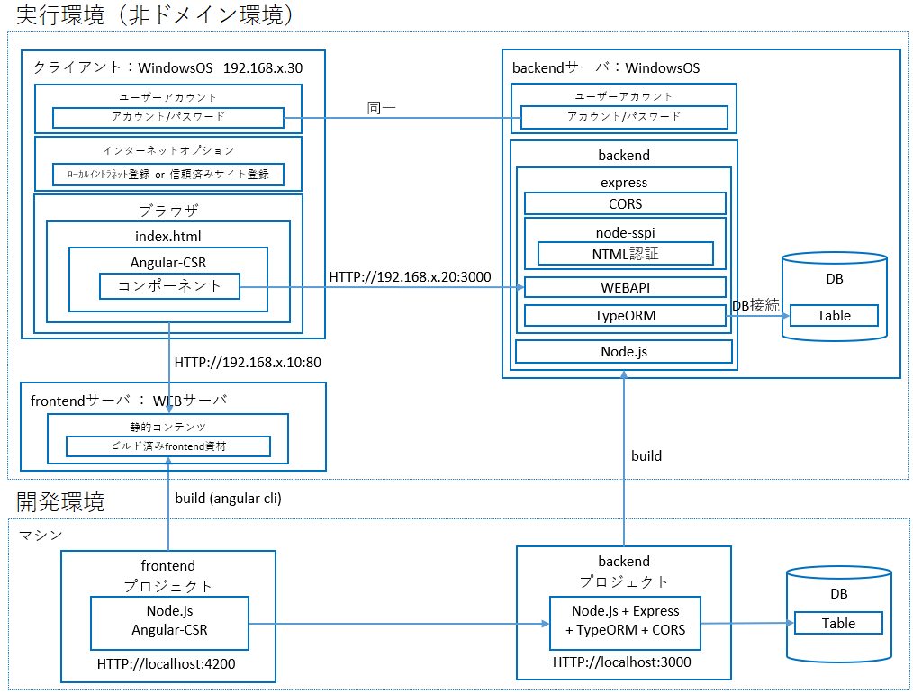

# angular-express-typeorm
Angular-CSR + Express Backend + node-sspi

## 概要

以下の動作検証を行うための、ユーザ管理アプリケーションを作成する
* frontendは、
  - `Angular`の`CSR(クライアントサイドレンダリング)`
  - 1画面でのユーザ管理（一覧表示、登録）
* backendは、
  - `Express` + `typeorm`を使用したWEBAPI
  - `node-sspi`を使用したWindows認証

## 構成

